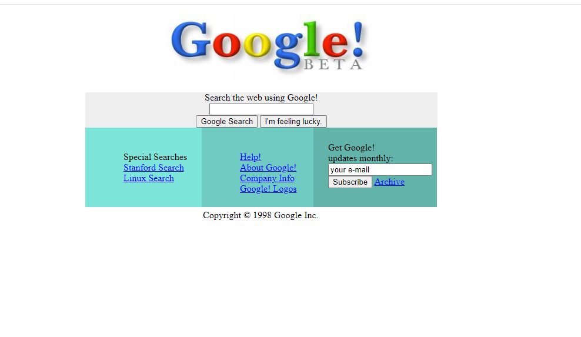
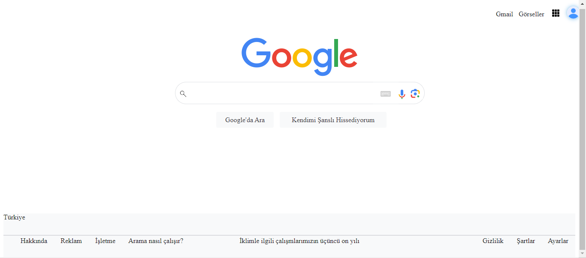

## Bu projede HTML , CSS öğrenirken gerçekleştirmiş olduğum örnekler bulunuyor.

----------------------------------
### **[Google 1998 yılındaki ana sayfası](https://academy.patika.dev/tr/courses/css/odev2)**

>👉Bu örnekte Google'ın 1998 yılında çıkarmış olduğu ilk versiyonunun  ana sayfasının html ve css kullanılarak tasarlanması gerçekleştirilmiştir.

------------------------------------
### **[Google Ana sayfası](https://academy.patika.dev/tr/courses/css/cssodev3)**
>👉Bu örnekte Google'ın  ana sayfası html ve css kullanılarak tasarlanmıştır.

-----------------------------------------------------
>***Sünger Bob sevmeyen var mı? 😊*** [Burada](https://github.com/Rmy-dh/FrontEndPatikasi/tree/master/src/Html/spongeBob) HTML ve Css öğrenirken  sünger bob sevenler için macera dolu  
>sayfalar hazırlamaya çalıştım bakalım gizli sırrı kim bulabilecek?🙈 🙉 🙊

--------------------------------------
[HTML - Patika.dev](https://academy.patika.dev/tr/courses/html) 
[CSS - Patika-dev](https://academy.patika.dev/tr/courses/css) 
[HTML - Code Academy](https://www.codecademy.com/learn/learn-html) 
[CSS - Code Academy](https://www.codecademy.com/learn/learn-css-introduction)
